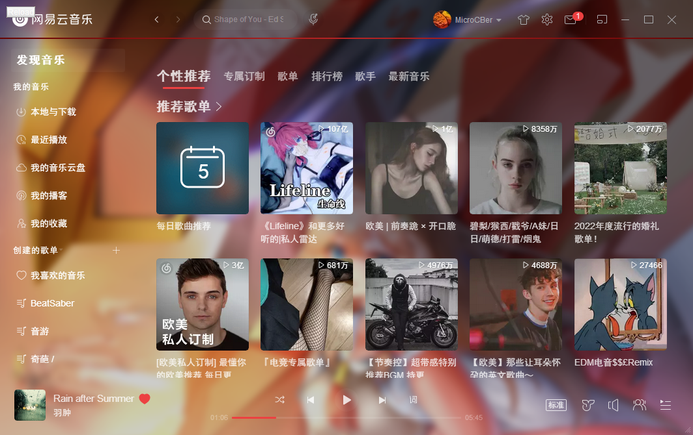
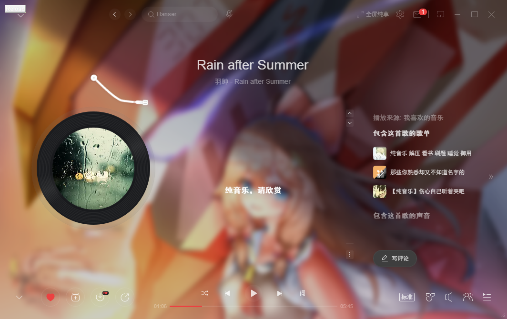
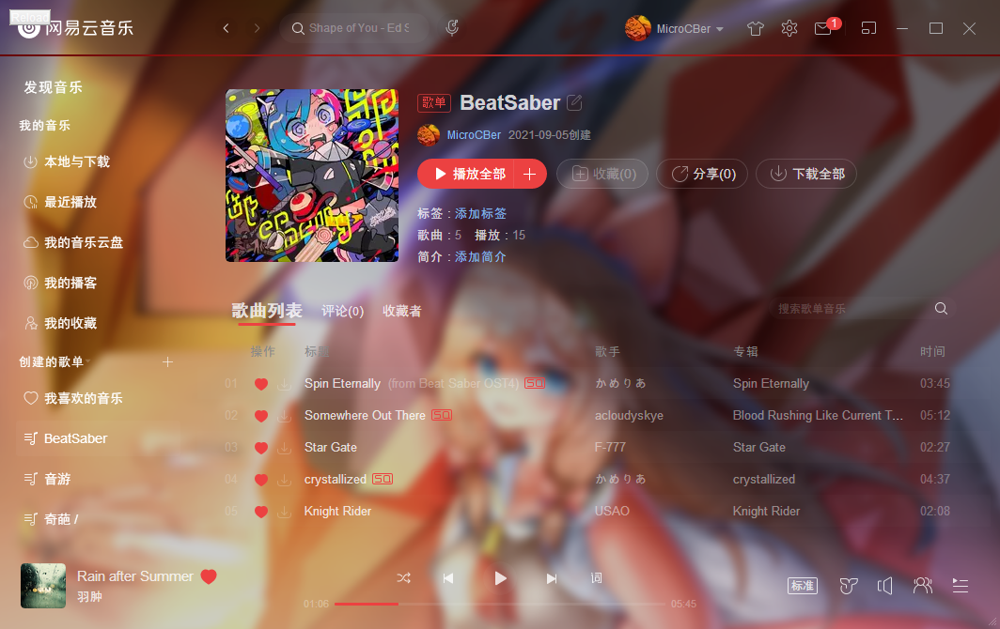

# 主题
主题使用前请确保`cssLoader`插件处于打开状态

该主题建议配合原版黑色主题使用
## Unbounded 无界
作者：*MicroBlock*



## 安装
在网易云内点击设置，滑到最下面，点击打开配置文件夹，将`Unbounded.css`放入stylesheets文件夹
#### Stylesheet JSON
```json
,{
    "name":"Unbounded",
    "file":"Unbounded.css",
    "enabled":false
}
```

## 自定义
自定义背景图：更改对应css文件的第二行为
```css
    background: url("图片地址");
```

